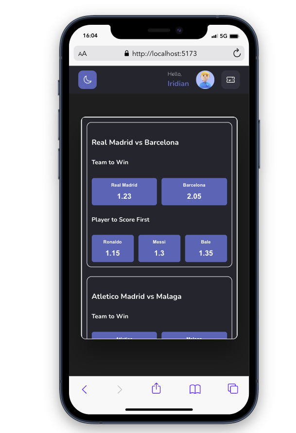

# MB Bet App


#### Description

The application is a web-based sports betting app that allows users to interact with different sports events and place bets intuitively. It is important to note that rules from similar real-life platforms have been considered. Below are the user stories covering the main functionalities of the application.

The goal of this test, in addition to creating the interface, is to demonstrate the ability to develop interfaces using components with maintainable and scalable code, achieved through file-level reusability and simplicity. From this small project, I approached it as I would in my role as a front-end developer, focused on building robust, scalable, and maintainable web applications by implementing best development practices.

Unit testing is fundamental to ensure code reliability, and techniques such as separating responsibilities between components and containers promote modularity, reusability, and ease of maintenance. Additionally, hiding business logic through encapsulation and design patterns facilitates collaboration and testability. My passion for these practices and commitment to code quality make me a valuable asset to any development team.

#### Screens

**Dark (Web)**


**Dark (Tablet)**


**Dark (Phone)**



**Light (Web)**


**Light (Tablet)**


**Light (Phone)**


**Technology Stack:**
This application was developed using the following technology stack:

- Reactjs
- TypeScript
- Redux Toolkit
- StyledComponents
- Jest

### User Stories

#### 1. Viewing User's Name and Selections

As a user, i want to see my name in the header of the homepage along with my avatar and a button to view my current selections, so tha i can have a quick reference to my identity and easily access my current selections.

**Acceptance Criteria:**

- The webApp must support switching between light and dark modes.
- By default, the application mode (light/dark) will match the system's mode where the app is running.
- The user's name must appear clearly in the header of the homepage.
- There should be an avatar next to the user's name.
- There should be a button next to the user's name that, when clicked, shows the selections made so far.
- There should be an indicator next to the ticket button that shows how many events have been added to the ticket; if there are no events, the indicator should not be displayed.

#### 2. Selecting Events and Markets

**As** a user,
**I want** to see a list of sports events with various markets within each,
**so that** I can select and bet on the events of my interest.

**Acceptance Criteria:**

- The user must see a list of events with various markets within each.
- The user can select as many events as they want.
- The user cannot select the same event twice.
- The user can add and remove events from the list using the same button that added them or directly from the ticket.
- The event add button will change color indicating that it has been added to the list.

#### 3. Modifying Bets by Removing Markets

**As** a user,
**I want** to modify my bets by removing any market I consider necessary,
**so that** I can adjust my selections according to my convenience.

**Acceptance Criteria:**

- The user must be able to see the list of selected markets.
- There must be an option to remove any market from the list of selections.
- The list of selections must update in real-time when a market is removed.
- The user can remove events from the ticket by pressing the button on each event.
- The user can remove all selected events in the ticket by pressing the "remove all" button.

#### 4. Placing Bets

**As** a user,
**I want** to place a bet by pressing the "bet" button,
**so that** I can confirm my selections and participate in the bets.

**Acceptance Criteria:**

- When placing a bet, the user will see a success notification.
- When there are no available events, the user will see a loader.
- When the user has no events added, they will see a message indicating the situation within the ticket.

### Additional Notes

- The interface must be intuitive and easy to use, with clear buttons and messages.
- Validation and restrictions must be applied in real-time to enhance user experience.
- The system must prevent the user from placing bets when the selected markets belong to the same event.

## Table of Contents

- [Installation](#installation)
- [Usage](#usage)
- [Project Structure](#project-structure)
- [Available Scripts](#available-scripts)
- [Configuration](#configuration)
- [Components](#components)
- [Global State Management](#global-state-management)
- [Styling](#styling)
- [Testing](#testing)
- [Future Improvements](#future-improvements)

## Installation

Instructions for installing dependencies and setting up the project.

```bash
git clone https://github.com/marioAbc93/mb-bet-app.git
cd project-name
npm install
```

## Usage

Before running the project, make sure to create a `.env` file with the following environment variables, which correspond to the local API where we will have the events.

```
VITE_MAIN_API=http://localhost:3000
```

Once created, proceed to execute the following command.

```bash
npm run dev
```

The API server will run at `http://localhost:3000`.
The webApp server will run at `http://localhost:5173`.

## Project Structure

The project is based on the Clean Architecture, structured as follows:

```
project-name/
├── public/
│   └── vita.svg
├── src/
│   ├── assets/
│   ├── components/
│   ├── constants/
│   ├── hooks/
│   ├── models/
│   ├── theme/
│   ├── App.tsx
│   ├── index.css
│   ├── main.tsx
│   ├── setupTest.ts
│   └── vite-env.d.ts
├── .gitignore
├── package.json
└── README.md
```

## Available Scripts

Explanation of scripts defined in `package.json`.

### `npm run dev`

Starts the application in development mode.

### `npm run test`

Runs the tests.

## Configuration

Before running the project, make sure to create a `.env` file with the following environment variables, which correspond to the local API where we will have the events.

```
VITE_MAIN_API=http://localhost:3000
```

## Components

To meet the expected requirements, I have developed the following components.

```
components/
├── app-container/
├── badge/
├── bet-container/
├── content/
├── custom-butom/
├── event-container/
├── header/
├── loader/
├── notification/
├── ticket-button/
└── ticket-component/
```

### Reusable Components

- **Button**: Custom button component.

## Global State Management

I have managed the state in two ways:

- **Entities:** I have opted to use Redux Toolkit to manage events and selections. For events, I make API calls where the responsibility of fetching data is separated into a 100% presentational component. Regarding selections, I manage the list of user selections to add them to the ticket and place bets. From here, the user can add or remove markets and finally place their bet.

- **Components:** For component communication, I have used context. Here, I manage behaviors such as rendering the ticket when I want to display its contents and rendering notifications. This approach allows us to create state in one central place and modify it where needed without passing props between parent and child components.

## Styling

Regarding styles, I have used styled-components because it is a sophisticated and flexible way to manage styles in our React applications. Being written in a JavaScript file, it can receive props and have modifications that are expected by the user.

## Testing

Here's the translation to English:

"Tests were implemented with Jest on 100% presentational components that receive props and directly impact their rendering. The components with unit tests are:

- Badge
- Button
- Loader
- Notification

Total test are done :sunglasses:

## Future Improvements

After this test, I would like to:

- Calculate the value of event prices and aggregate them in combined or multiple bets.
- Stop using Jest and perform tests with Cypress.
